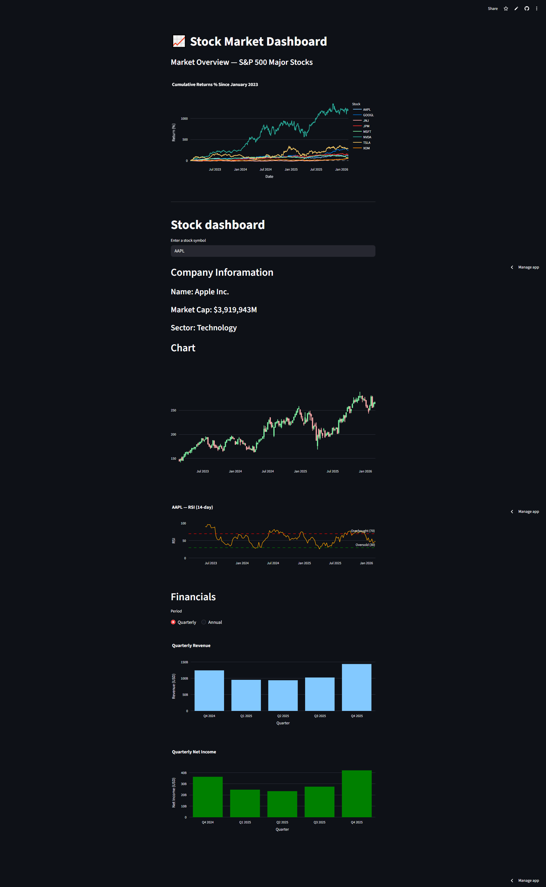
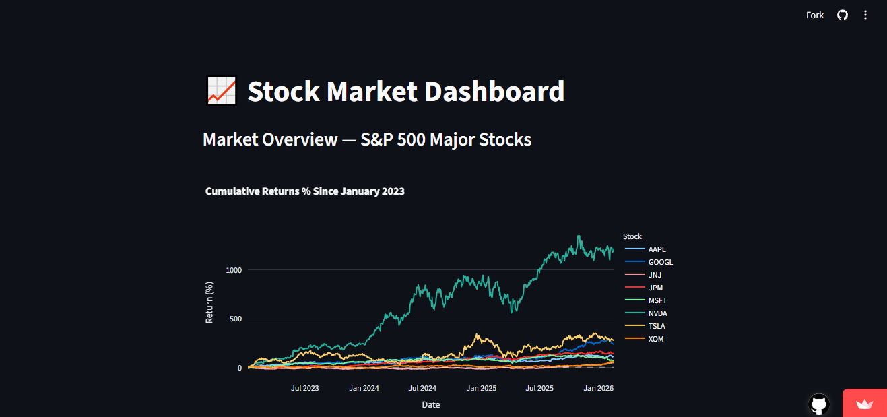
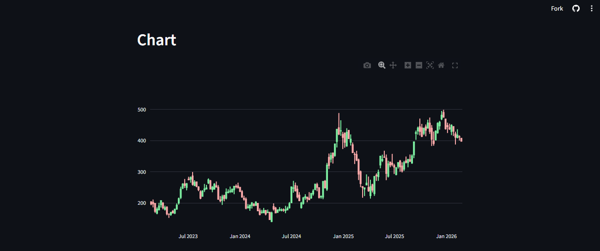
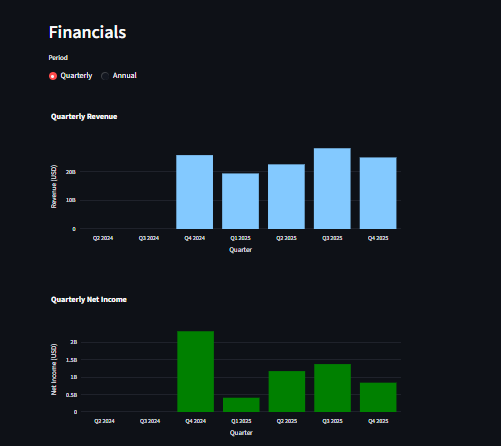
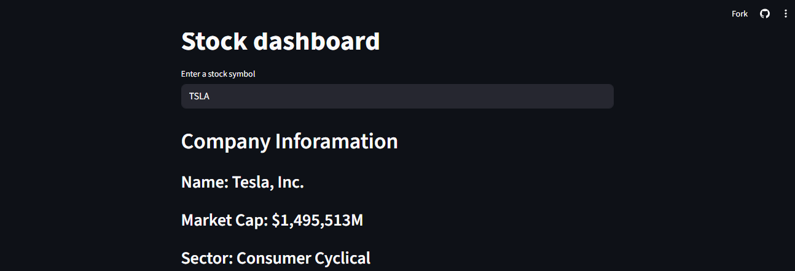

# 📈 Financial Dashboard — Multi-Stock Analysis (2023–2026)

An interactive financial dashboard built with **Python**, **Plotly**, and **yfinance** to analyze and visualize stock performance, technical indicators, and financial fundamentals for 8 major companies.

---

## 🖥️ Dashboard Preview



---

## 📸 Screenshots

| View | Preview |
|------|---------|
| Cumulative Returns |  |
| Candlestick Chart |  |
| RSI Indicator |  |
| Financials (Revenue & Net Income) |  |
| Ticker View |  |

---

## 📊 Key Findings (Jan 2023 – Feb 2026)

| Ticker | Company | Total Return % |
|--------|---------|---------------|
| NVDA | NVIDIA | +1213.92% |
| TSLA | Tesla | +280.86% |
| GOOGL | Alphabet | +242.39% |
| JPM | JPMorgan Chase | +146.58% |
| AAPL | Apple | +111.69% |
| MSFT | Microsoft | +70.68% |
| XOM | ExxonMobil | +58.19% |
| JNJ | Johnson & Johnson | +51.80% |

> NVIDIA was the standout performer with a return of over **1,200%**, driven by the AI chip demand surge.

---

## ⚙️ Features

- 📉 **Cumulative Returns** — Compare all 8 stocks on a single chart over the full period
- 🕯️ **Candlestick Charts** — OHLC price history per stock with volume overlay
- 📐 **RSI Indicator** — Relative Strength Index to identify overbought/oversold conditions
- 💰 **Financials** — Quarterly and annual revenue and net income per company
- 🔍 **Ticker View** — Deep dive into any individual stock

---

## 🛠️ Tech Stack

| Tool | Purpose |
|------|---------|
| `Python` | Core language |
| `yfinance` | Fetch historical stock & financial data |
| `Pandas` | Data manipulation and transformation |
| `Plotly` | Interactive charts and visualizations |
| `Jupyter Notebook` | Exploratory analysis |

---

## 🚀 Getting Started

### 1. Clone the repository
```bash
git clone https://github.com/brhosul02/financial-dashboard.git
cd financial-dashboard
```

### 2. Install dependencies
```bash
pip install -r requirements.txt
```

### 3. Run the dashboard
```bash
python dashboard.py
```

---

## 📁 Project Structure

```
financial-dashboard/
│
├── dashboard.py              # Main dashboard script
├── requirements.txt          # Project dependencies
├── README.md
│
├── data/
│   ├── stock_data_raw.csv    # Raw data fetched from yfinance
│   └── stock_data_clean.csv  # Cleaned and processed data
│
├── notebooks/
│   └── exploratory_analysis.ipynb
│
└── screenshots/
    ├── full.png
    ├── cumulative.png
    ├── candle.png
    ├── rsi.png
    ├── ticker.png
    └── financials.png
```

---

## 👨‍💻 Author

**Ibrahim Alsaeed**  
[GitHub](https://github.com/brhosul02)

---

## 📄 License

This project is open source and available under the [MIT License](LICENSE).
